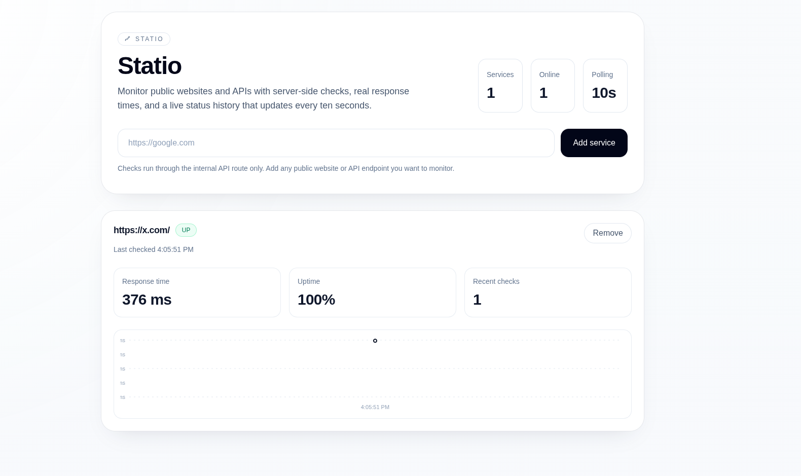

# Statio



Statio is a lightweight monitoring dashboard for public websites and APIs. It lets you add any public `http` or `https` endpoint, checks it through a server-side API route, and shows live status, response time, uptime, and recent response history in a clean interface.

The application is built with Next.js App Router, React, Tailwind CSS, and Recharts. All monitoring data comes from real HTTP requests. No mock data is used anywhere in the app.

## Features

- Monitor public websites and APIs in real time
- Server-side health checks through `/api/check`
- Live response time tracking
- Status badges for `UP` and `DOWN`
- Uptime percentage based on recent checks
- Lightweight response history chart for each service
- Local persistence of monitored URLs with `localStorage`
- Clean, minimal UI designed for a simple monitoring workflow

## Tech Stack

- Next.js
- React
- Tailwind CSS
- Recharts
- JavaScript

## How It Works

When a user adds a URL, Statio stores that URL in local browser storage and starts checking it on a 10-second interval. The frontend does not call the external URL directly. Instead, it sends a request to the internal API route at `/api/check`.

That API route performs the actual server-side fetch, measures the response time using `performance.now()`, and returns a normalized result to the client:

```json
{
  "status": "UP",
  "responseTime": 376
}
```

The dashboard then updates the service card with the latest result and appends the response time to the chart history.

## Project Structure

```text
app/
  api/check/route.js
  globals.css
  icon.svg
  layout.js
  page.js
components/
  ResponseChart.jsx
  ServiceCard.jsx
```

## Installation

Install dependencies:

```bash
npm install
```

Start the development server:

```bash
npm run dev
```

Open `http://localhost:3000` in your browser.

## Production Build

To create a production build:

```bash
npm run build
```

To run the production server after building:

```bash
npm run start
```

## Usage

1. Enter a public website or API URL.
2. Click `Add service`.
3. Wait for the first check to complete.
4. Review the live status, response time, uptime, and chart.
5. Remove a service at any time from the card.

## Notes

- The monitored URL list is persisted in `localStorage`.
- Response history is kept in memory and is refreshed when the page reloads.
- A service is currently marked `UP` only when the upstream response returns HTTP `200`.
- Polling runs every 10 seconds.

## Scripts

- `npm run dev` starts the local development server
- `npm run build` creates the production build
- `npm run start` runs the production server

## License

This project is available for personal and educational use. Add your preferred license if you plan to publish or distribute it.
